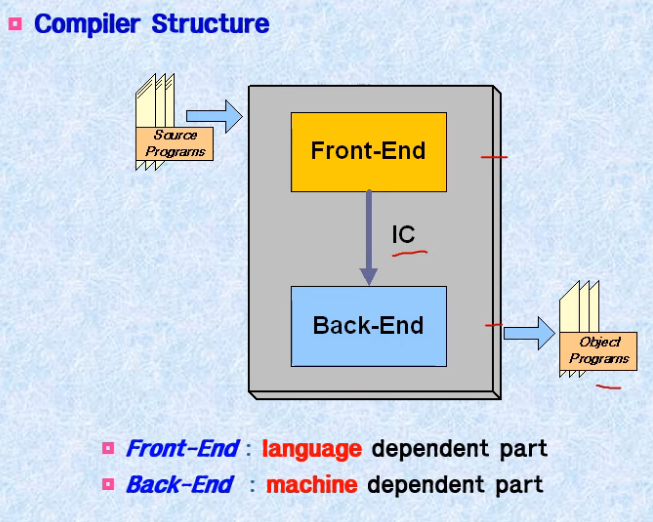
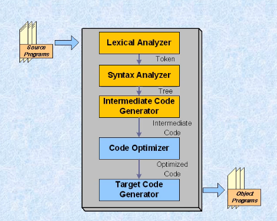
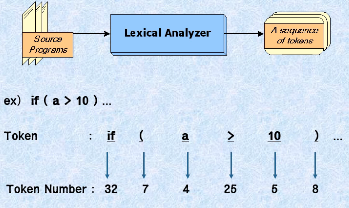
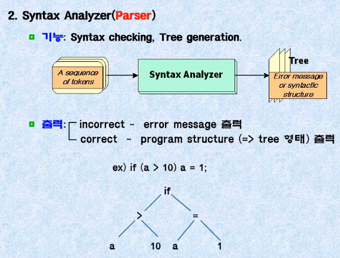
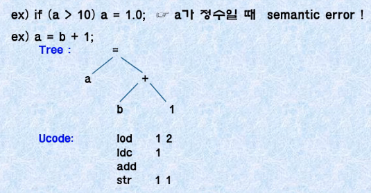

# COMPILER OT [20.08.31]

## Compiler

- 일반적 컴파일러 구조
  
- 운영체제에서 사용
- 전체를 읽고 실행

## 컴파일러의 종류

- Cross Compiler
  다른기종에 맞는 목적코드를 만들어 내는 컴파일러

- Interpreter
  - 개발 시스템 또는 교육용 시스템
  - 한줄한줄 읽어가며 중간에서도 실행이가능

- Preprocessor(전처리기)
  - Macro substitution : 자주쓰는 기능 지정 (매크로 기능)
  - Conditional compilation : # 이나 if처럼 수행할 코드와 수행하지 않을 코드 구분 (조건부 컴파일)
  - Inclusion of files : 외부 파일 불러오기

## 컴파일러의 구조

### 전단부 : Lexicla Analyzer, Syntax Analyzer, Intermediate Code Generator 로 중간 코드생성

#### 1. Lexical Analyzer (어휘 분석기:Scanner)

토큰(Token) : 문법적으로 의미를 갖는 최소의 단위
Token Number : 토큰마다 매칭되는 고유한 숫자가 있음

#### 2. Syntax Analyzer (구문 분석자: Parser)

구문을 문법적으로 체크한다.

트리형태의 구문분석이 만들어진다.

Parse 트리와 추상 구문 트리로 두가지가 있다.

#### 3. Intermediate Code Generator

Semantic checking : 타입 자료형을 체크(의미분석)

Intermediate Code Generation : 중간 코드 생성(예: Ucode 사용)

### 후단부 : Code Optimizer(최적화), Target Code Generator목적 코드 생성

#### 4. Code optimizer

- Optional phase
- 코드 최적화 단계
- 비효율적인 code를 구분해 내서 더 효율적인 code로 바꾸어 준다.

- Meaning
  - major part : improve running time
  - minor part : reduce code size
  
- Criteria(기준)
  - preserve the program meanings (보존성)
  - speed up on average
  - be worth the effort

지역 최적화

- 컴파일시간 상수 연산
- 중복된 코드제거, 불필요한 코드 제거
- 연산량 감소

전역 최적화

- 전체과정의 흐름을보고 줄이는것 최적화의 범위와 위치에따라 구분

### Error Recovery

- Error recovery : error가 다른 문장에 영향을 미치지 않도록 수정
- Error repair : error가 발생하면 복구해 주는 것
