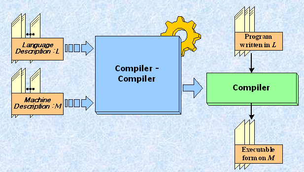
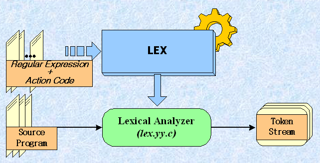
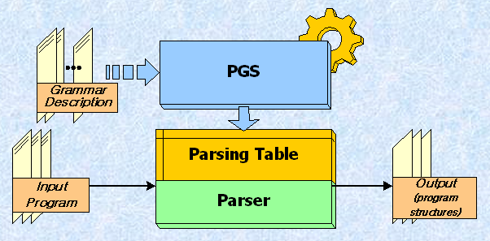
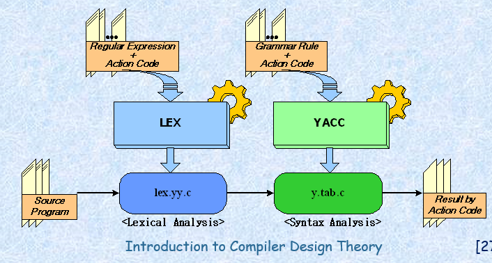

# 컴파일러 자동화 도구

- Compiler Generating Tools
- Language가 발달할수록 많은 Compiler가 필요
- N개의 language가 M개의 machine에서 구현하려면 N*M개의 compiler가 필요
- Compiler-Compiler Model
    
  - 언어와 머신을 받아들여 해당 컴파일러로 자동화

1.어휘 분석기 생성기 

  - LEX : 정규표현식과 액션 코드로 어휘 분석기를 생성  
  

2.파서 생성기

  - 기본 PGS(parser generating system)
    
    1.stanford PGS

    2.wisconsin PGS

    3.YACC (대표적인 PGS)

      - Unix에서 수행
      - C language로 제작
        

4장때 다시나오고 레포트 있음

3. 컴파일러 자동화
  - PQCC: 전단부를 잘만듬, TCOL이라는 트리구조의 언어가 성능이 좋았다고 함.
  - ACK : 후단부를 자동화하기 위한 도구의 하나, 이식성과 재목적성이 높은 컴파일러를 만들기위한 실질적인 도구