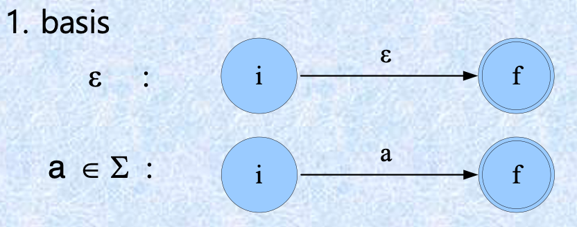
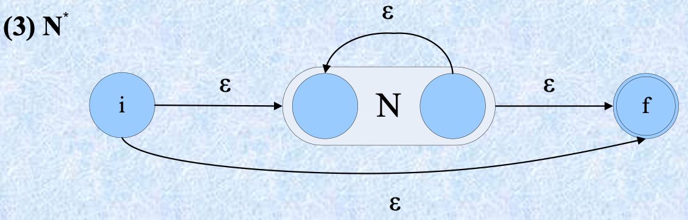
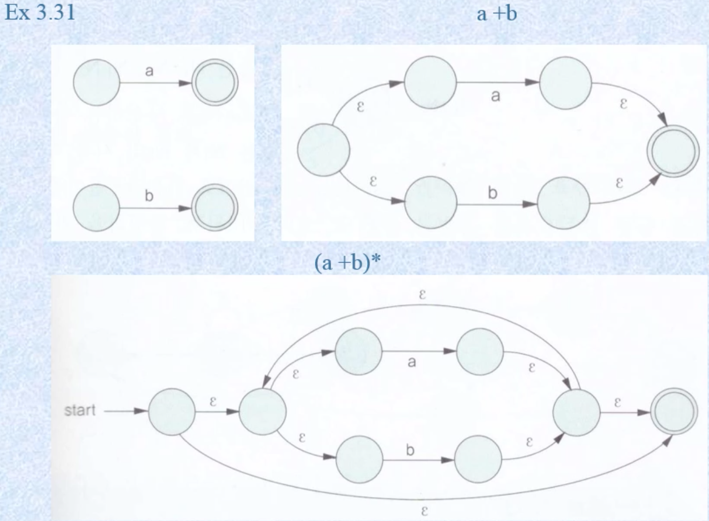
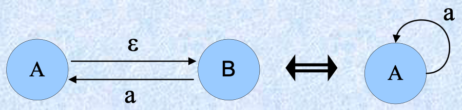
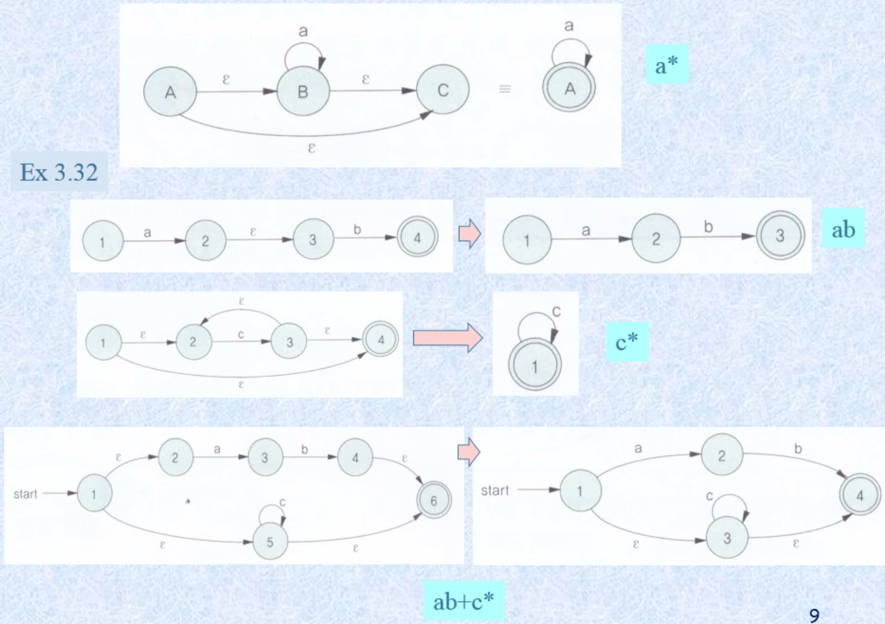
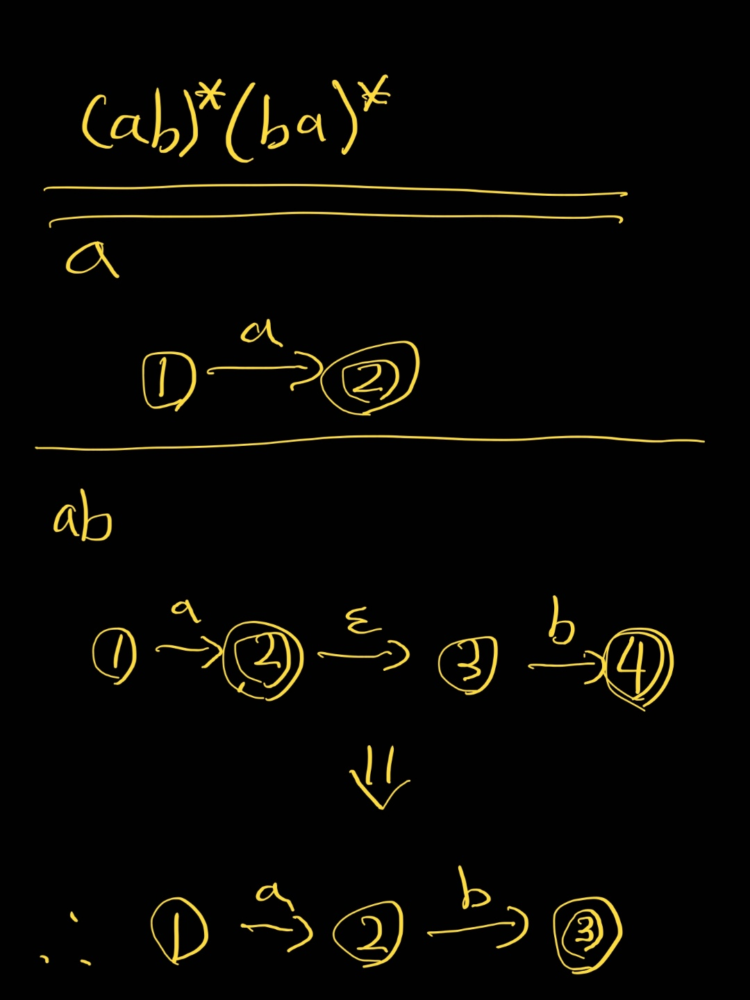
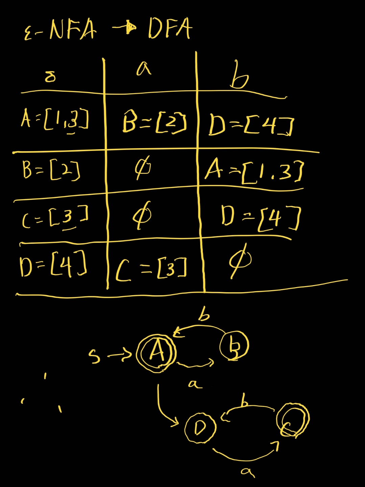

# 정규언어의 속성

정규언어를 표현하는 3가지 방법을 배워왔다.

- 정규문법(rg)
- 정규표현(re)
- 유한오토마타(fa)

이 세가지를 종합하는 단계이다. 서로 상호간에 전환이 가능하고 이 방법들을 볼 것이다.

## 정규문법과 유한오토마타의 관계

정규문법과 유한오토마타의 차이는 종결상태의 표시 여부이다.
G = (VN, VT, P, S) , M = (Q, ∑, δ, q0, F)

### 정규문법을 유한오토마타로 변환하기

1. Q = VN U {f}, where f is a new final state
2. ∑ = VT
3. q0 = S

정규문법에서 전이 함수가 없이 끝나는 함수인 `S -> 1` 이 있다면 이에 종결 전의 함수 f를 붙여주면 fa로 만들 수 있다. `S -> 1f` 와같이 만들고 새로 생성된 상태 f는 입력값에 의해 공집합으로 보내면 변환이 완료된다.

### 유한오토마타를 정규문법으로 변환하기

1. VN = Q
2. VT = ∑
3. S = q0
4. 종결상태에대해서 ε을 꼭 추가해야한다. 추가하지 않을시 전이함수가 끝없이 이어져 다른 문법이된다.

### 유한오토마타를 정규표현식으로 변환하기

fa -> rg -> re

정규 문법으로 변환 후 정규 표현식으로 표현한다.

이전에 배운 변환 방법들을 잘 숙지해왔다면 쉽게 변환할 수 있다.

- [ 유한 오토마타를 정규문법으로 바꾸는방법 ]()
- [ 정규문법을 정규표현식으로 나타내는 방법 ]()

### 정규표현식을 유한오토마타로 변환하기

> 뭔가 이부분이 꽃인거같은데

1. 기본 표현
   - 
   - 일반적인 기본구성으로 `a` 또는 `ε`이 필요한 부분에서 위와같이 표시한다.
2. 연산시 표현
   - N1 + N2
     - 
     - 앞에 [NFA닫힘성질]()에서 배운것과 같이 `ε`을 이용하여 새로운 시작상태를 하나 생성하여 각각의 fa(유한오토마타)를 연결하고 종결상태까지 연결한다.
   - N1N2
     - 
     - `ε`으로 두 곱연산을 할 두 fa를 이어준다.
   - N1\*
     - 
     - 모든 터미널 심볼을 표현가능함을 의미하는 `*`은 `ε`또한 포함이고 이를 표현하기위해 새로은 시작상태와 종결상태를 만들고 `ε`으로 이어주며 내부의 N1의 종결상태와 시작상태를 `ε`으로 이어준다.~~(이게 N1의 종결상태와 시작상태를 이어주는게 맞는지 확신이 안서서 질문을 해봐야할듯하다)~~
3. 위의 모든것들을 간단한 예로 표현하면
   - 
4. 줄이기
   - 
   - 

#### 실습

(ab)\*(ba)\*

## 정규언어의 닫힘 성질

> 만약 L1, L2가 정규언어이면,
>
> 1. L1 | L2
> 2. L1L2
> 3. L1\*는 정규언어이다.

ex)\
 P1 : S → aS | bA A → aA | a\
 P2 : X → 0X | 1Y Y → 0Y | 1\
 ⇒ P : S → aS | bA A → aA | aX X → 0X | 1Y Y → 0Y | 1
