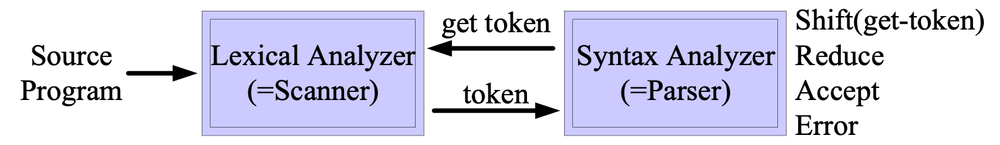

## 어휘분석(Lexical analyzer) (1)

### 서론

기능 : 사용자가 작성한 소스프로그램을 [토큰](#token)으로 분할

Lexicla analyzer == Scanner == Lexer

#### Token

##### 정의 : 문법적으로 의미 있는 최소의 단위

- Token : 단일 구문(문법)체 (terminal symbol)
  - 특수 형태의 토큰
    1. 지정어(keyword) : const, else, if, int ...
    2. 연산자 기호(operator symbol) : +, -, \*, /, ++ ...
    3. 구분자 : , ,, ... `
  - 일반 형태의 토큰
    1. 명칭(identifier) : sulmo, value, sum1, sum2, 등등 일반 변수
    2. 상수(constant) : 255, 0xFF, 2.55, 0.255e-10, 'c', 'string' 등 상수 값
- Token Number : string 처리의 효율성을 위한 토큰별 정수 값
- Token Value : 실제 토큰의 값

- Token Structure : 정규표현식으로 표현된 토큰 구조 예시
  ex) id = ( l + _ )( l + d + _ )\*
  -> 처음에 \_ 또는 l(letter) 하나가 오고 이후에 l이든 d(digit:숫자)든 무한으로 오는 구조를 말함

##### 스캐너와 파서의 관계

구문분석기가 어휘분석기를 호출하여 사용하는 형태이다.

구문분석기가 어휘분석기에게 토큰을 요청하면 어휘분석기가 소스코드를 토크화하여 구문분석기에게 넘긴다 이를 가지고 문법적오류나 잘못된 구문을 찾는역할을 수행한다.

인식기로 구분하자면

- 구문분석기(Lexical:Scanner) : finite 오토마타
- 어휘분석기(Syntax analyzer:Parser) : pushdown 오토마타

##### Token type

Scanner가 Parser에게 넘겨주는 토큰형태 : (token number, token value)

토큰에대한 숫자와 값 쌍으로 넘김

##### 어휘분석과 구문분석을 따로 나눠서 하는 이유

1. 모듈 구성하기가 좋다
2. 컴파일 효율성이 향상된다
3. 컴파일 이식성이 향상된다.
   (일반적인 모듈화와 이유가 비슷하다.)

#### Parsing table

파서에서 pushdown오토마타는 다음과 같은 기능들을한다

1. Shift
2. Reduce
3. Accept
4. Error

[5장]()에서 어느정도 다루지만 오토마타에대한 내용은 공학적으로 깊게 파면 한학기분량으로 나오는 내용으로 [유한오토마타](https://jeoungsulmo.github.io/posts/compiler/5)가 오토마타중 **가장 간단한 구조**라고 한다. 기회가 된다면 해보는걸로

### 토큰 인식

### 어휘분석기 구현

### 렉스
