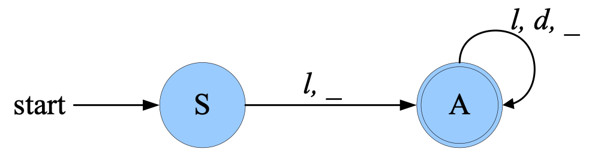
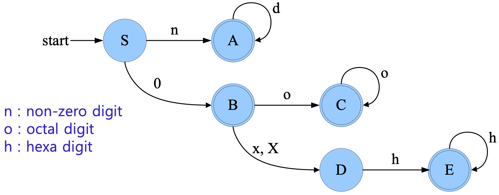
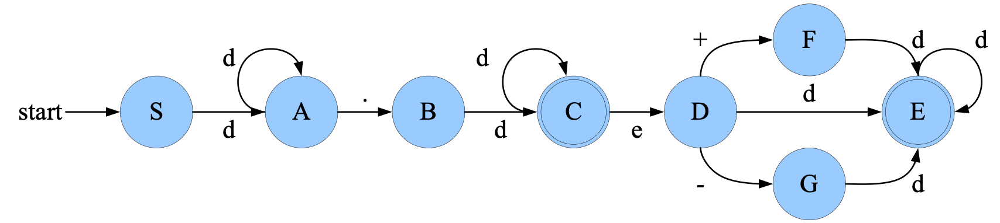
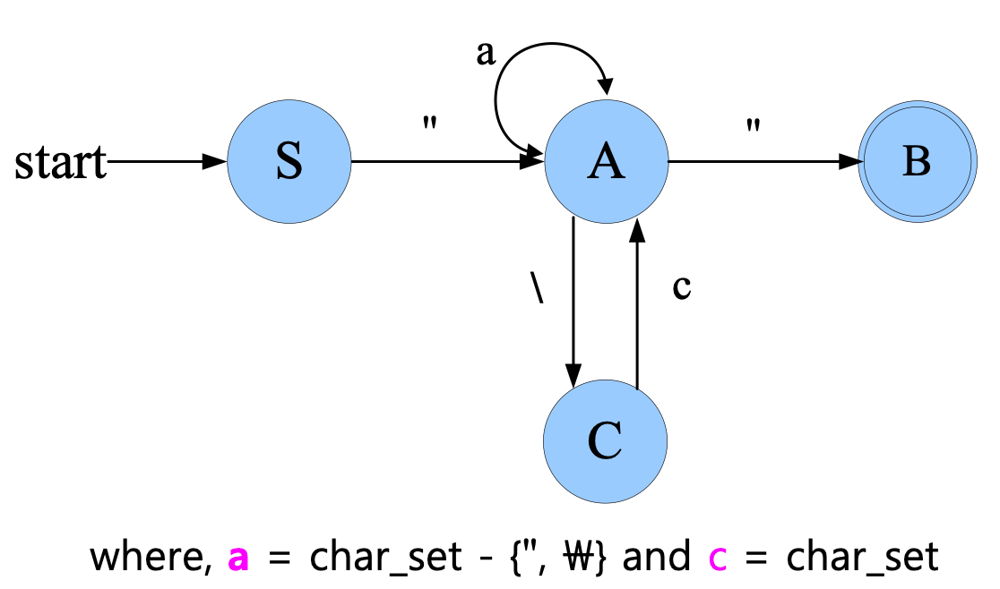
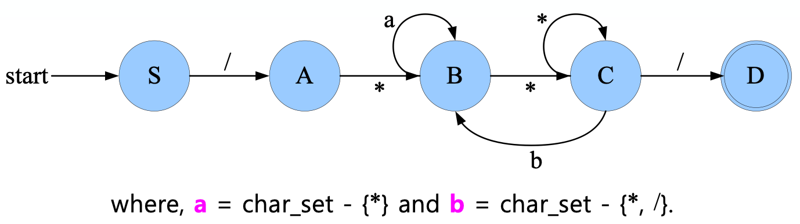

## 어휘분석(Lexical analyzer) (2)

### 토큰 인식

시작전에 알아야할 것들

1. 토큰의 구조를 기술시 이용될 [정규표현](https://jeoungsulmo.github.io/posts/compiler/4)
2. 인식기를 설계하는데 편리한 [상태 전이도](https://jeoungsulmo.github.io/posts/compiler/5#%EC%83%81%ED%83%9C-%EC%A0%84%EC%9D%B4%EB%8F%84)와 [유한오토마타를 정규표현으로부터 얻는 것](https://jeoungsulmo.github.io/posts/compiler/6#%EC%A0%95%EA%B7%9C%ED%91%9C%ED%98%84%EC%8B%9D%EC%9D%84-%EC%9C%A0%ED%95%9C%EC%98%A4%ED%86%A0%EB%A7%88%ED%83%80%EB%A1%9C-%EB%B3%80%ED%99%98%ED%95%98%EA%B8%B0)
3. 토큰의 종류를 인식하는 인식기를 구성하기위해 먼저 문자의 종류를 다음과 같이 이해하고 진행한다.
   `letter` -> a | b | c |... | z | A | B | C | ... | Z
   `digit` -> 0 | 1 | 2 | ... | 9
   `special_char` -> + | - | \<sup><sup\*</sup></sup> | / | , | ; | ...
   편의상 `letter`를 l 로, `digit`은 d로 나타내기로 하자.

### C언어에서 변수 정수, 실수, 문자, 주석인식

C에서 정수 상수의 기준은 10진수, 8진수 16진수이다.

10진수는 0이 아닌 수 8진수는 0으로 16진수는 0x 또는 0X로 시작한다.

편의상 10진수를 non-digit `n`으로 8진수를 octal digit `o`로 16진수를 hexa digit `h`로 지정하겠다.

#### 명칭(변수) 인식

c언어 기준으로 명칭구조는 아래의 전이도와 같다.



##### 정규문법으로 표현

S -> lA | \_A  
 A -> lA | dA | \_A | ε

##### 최종적으로 정규표현식으로 표현 (A = aA+b ==> A = a<sup>\<sup><sup\*</sup></sup></sup>b)

S = (l + _)( l + d + _)<sup>\<sup><sup\*</sup></sup></sup>

#### 정수 및 상수 인식

##### 정수및 상수 인식 전이도



##### 정규문법으로 표현

S -> nA | 0B
A -> dA | ε
B -> oC | xD | XD | ε
C -> oC | ε  
D -> hE  
E -> hE | ε

##### 정규표현식으로 표현

E = hE + ε = h<sup>_</sup>ε = h<sup>_</sup> D = hE = hh<sup>_</sup> = h<sup>+</sup>  
C = oC + ε = o<sup>_</sup>
B = oC + xD + XD + ε = o<sup>+</sup> + (x + X)D = o<sup>+</sup> + (x + X)h<sup>+</sup> + ε
A = dA + ε = d<sup><sup\*</sup></sup>

S = nA + 0B = nd<sup>_</sup> + 0(o<sup>+</sup> + (x + X)h<sup>+</sup> + ε)
= nd<sup>_</sup> + 0 + 0o<sup>+</sup> + 0(x + X)h<sup>+</sup>

∴ S = nd<sup\*</sup> + 0 + 0o<sup>+</sup> + 0(x + X)h<sup>+</sup>

#### 실수 인식

##### 실수인식 전이도



##### 정규문법으로 표현

S -> dA  
D -> dE | +F | -G
A -> dA | .B  
E -> dE | ε
B -> dC  
F -> dE
C -> dC | eD | ε  
G -> dE

##### 정규표현식으로 표현

E = dE + ε = d*
F = dE = dd* = d<sup>+</sup>  
G = dE = dd* = d<sup>+</sup>
D = dE + '+'F + -G = dd* + '+'d<sup>+</sup> + -d +
= d<sup>+</sup> + '+'d<sup>+</sup> + -d<sup>+</sup> = (ε + '+' + -)d +

C = dC + eD + ε = dC+e(ε + '+' + -)d<sup>+</sup> + e
= d<sup>\*</sup>(e(ε + '+' + -) d<sup>+</sup> + ε)

B = dC=dd<sup\*</sup>(e(ε + '+' + -)d<sup>+</sup> +ε)
= d<sup>+</sup>+(e(ε + '+' + -) d<sup>+</sup> +ε)

A = dA + .B
= d<sup>\*</sup>.d+(e(ε + '+' + -)d<sup>+</sup> + ε)

S = dA
= dd<sup>\*</sup>. d<sup>+</sup>(e(ε + '+' + -) d<sup>+</sup> +ε)  
= d<sup>+</sup>.d<sup>+</sup>(e(ε + '+' + -) d<sup>+</sup> + ε)  
= d<sup>+</sup>.d<sup>+</sup>+ d<sup>+</sup>.d<sup>+</sup>e(ε + '+' + -) d<sup>+</sup>

#### 문자 인식

##### 문자인식 전이도



##### 정규문법으로 표현

S -> "A
A -> aA | "B | \C
B -> ε  
C -> cA

##### 정규표현식으로 표현

A = aA + " B + \C  
 = aA + " + \cA
= (a + \c)A + "
= (a + \c)<sup>\*</sup>"

S = " A
= "(a + \c)<sup>\*</sup>"

∴ S = "(a + \c)<sup>\*</sup>"

### 어휘분석기 구현

#### 주석 인식

##### 주석인식 전이도



##### 정규문법으로 표현

S -> /A
A -> *B
B -> aB | *C
C -> \*C | bB | /D
D -> ε

##### 정규표현식으로 표현

C = *C + bB + /D = \*<sup>\*</sup>(bB + /)
B = aB + \*\*<sup>\*</sup>(bB + /)
= aB + \*\*<sup>\*</sup>bB + \*\*<sup>\*</sup>/
= (a + \*\*<sup>\*</sup> b)B + \*\*<sup>\*</sup>/= (a + \*\*<sup>\*</sup>b)<sup>\*</sup>\*\*<sup>\*</sup>/
A = *B = _(a + \*\*<sup>\*</sup>b)\*\*<sup>\*</sup>_/
∴ S = /A = /\* (a + \*\*<sup>\*</sup>b)<sup>\*</sup>\*\*<sup>\*</sup>/

### 어휘분석기 구현

어휘분석기를 구현하는데 있어서는 두가지방법이 있다.

- Programming : 일반적 프로그래밍 언어로 구현
- Generating : 컴파일러 생성기 툴을 이용하는건데 **LEX**와 같은 것들이 있다.

### 렉스

- 정의 : 어휘분석 생성기로 정규표현으로 기술된 토큰들을 찾아내는 프로그램을 작성하는데 유용한 도구
- 기능 : 사용자가 정의한 정규 표현과 액션 코드를 입력으로 받아 C언어로 쓰여진 프로그램을 출력

만들어진 프로그램은 정규표현에 해당하는 토큰을 찾으면 그와 결합된 액션 코드를 실행하게된다. (뭐지 리듀선가)

렉스로 토큰구조 기술 그리고 c언어로 action들을 작성하는 구조라고 한다.

#### 렉스의 입력

`test.l`

```lex
<정의 부분>
%%
<규칙 부분>
%%
<사용자 부프로그램 부분>
```

---

##### 정의 부분

액션코드를 C언어로 작성할때 필요한 자료구조, 변수, 상수들을 선언할 수 있는 부분이다.

```lex
%{
   해당 부분의 코드는 lex의 출력인 lex.yy.c의 앞부분에 복사한다.
%}
이름1    치환식1
이름2    치환식2
...
```

이름부분은 특정한 정규표현식을 하나의 이름으로 정의해주는 부분이다.
이름은 최소 한개의 문자로 구성 되고 [<규칙 부분>](#규칙-부분)에서 사용될때 {}사이에 입력을 해줘야 한다. 이름과 치환식 사이는 하나의 공백 또는 탭(tab) 문자로 분리되어야 한다.

예시 )

```lex
%{
    #include <stdio.h>
    #include <stdlib.h>
    enum tnumber {TEOF,TIDEN, TNUM, TASSIGN, TADD, TSEMI, TDOT, TBEGIN, TEND, TERROR};
%}
letter  [a-zA-Z]
digit   [0-9]
%%
{letter}({letter}|{digit})*   return tident;
```

---

##### 규칙 부분

```lex
%%
R1    A1
R2    A2
...
```

R은 정규표현식 A는 action으로 입력스트림에서 일치되는 R을 찾으면 어휘분석기가 행동을 기술하는 액션코드로 c프로그램이 작성된다.

예시 )
%%

```lex
begin                           return(TBEGIN);
end                             return(TEND);
{letter}({letter}|{digit})*     return(TIDEN);
":="                            return(TASSIGN);
"+"                             return(TADD);
{digit}+                        return(TNUM);
";"                             return(TSEMI);
\.                              return(TDOT);
[ \t\n]                         ;
.                               return(TERROR);
%%
```

##### 사용자 부프로그램 부분

사용자가 정의, 규칙 부분에서 작성한 내용대로 파일을 만들지 텍스트 콘솔을 찍을지 등을 자유롭게 원하는대로 작성하는 부분이다.

다음 아래의 예는 c언어로 콘솔창에 작업된 순서대로 로그를 찍은 예제이다.

```lex
int main(){
    enum tnumber tn;
    printf(" Start of Lex\n");
    while((tn=yylex()) != TEOF) {
        switch (tn) {
            case TBEGIN     : printf("Begin\n"); break;
            case TEND       : printf("End\n"); break;
            case TIDEN      : printf("Identifier\n"); break;
            case TASSIGN    : printf("Assignment_op\n"); break;
            case TADD       : printf("Add_op\n"); break;
            case TNUM       : printf("Number: %d\n",atoi(yytext)); break;
            case TSEMI      : printf("Semicolon\n"); break;
            case TDOT       : printf("Dot\n"); break;
            case TERROR     : printf("Error: %c\n", yytext[0]); break;
        }
    }
    return 0;
}
int yywrap(){
    printf(" End of Lex\n");
    return 1;
}
```

##### 렉스의 정규 표현

[<규칙부분>](#규칙-부분) 예제에있는 정규표현식을 보면서 읽어보면 생각하기 쉽다.

- `"` : `"`사이에있는 모든 문자는 텍스트 문자로 취급한다.
- `\` : 한개의 문자만 텍스트취급 하고싶을 때 사용한다.
  (`a"+"b`와 `a\+b`는 같은 의미이면 모두 문자열 a+b를 나타낸다. )
- `[]` : 문자들의 종류를 정의 할때 사용한다. 예로 [abc]는 a,b,c중 하나를 의미하며 해당 괄호 안에서 `-`,`^`,`\`만이 특수한 의미를 가진다.
  - `-`는 범위를 표시 : `[abc]`는 `[a-c]`와 같다.
    - `[a-z]`: a부터 z까지 소문자를 의미
    - `[-+0-9]` : 두개의 부호를 가진 숫자를 의미
    - `[A-Za-z0-9]` : 영문과 숫자를 나타냄
  - `^`은 여집합을 의미 : ^ 이후 나오는 문자를 제외한을 의미
    - [^*] : \*문자를 제외한 모든 문자
    - [^a-za-z] : 영문을 제외한 모든 문자
  - `\`는 C언어의 에스케이프 문자열로 간주
    - `[ \t\n]` : 공백, 탭 ,개행 문자 중 하나를 말한다.
    - `[\40-\176]` : (8진수 기준)[아스키 값](https://ko.wikipedia.org/wiki/ASCII#%EC%B6%9C%EB%A0%A5_%EA%B0%80%EB%8A%A5_%EC%95%84%EC%8A%A4%ED%82%A4_%EB%AC%B8%EC%9E%90%ED%91%9C.) 40(공백)부터 176(~)까지의 모든 인쇄 가능한 문자를 나타냄
- `*` : 앞서 배운 정규언어에서 [정규표현의 정의](https://jeoungsulmo.github.io/posts/compiler/4#%EC%A0%95%EA%B7%9C%ED%91%9C%ED%98%84%EC%9D%98-%EC%A0%95%EC%9D%98)와 같이 없는것(공집합)을 포함한 모든 가지의 수를 의미한다.
  `[a-z][A-Z]*`: 첫문자는 소문자 그리고 이후 대문자로만 구성된 문자열을 표현한 것
- `+` : `*`에서 없는것(공집합)만 없는 기능을 한다. 무조건 1개이상이 필요하다.
- `?` : 선택을 의미하는 연산자이다.
  `ab?c` : abc 또는 ac를 나타낸다 b를 선택적인 조건을 줘 b가 있거나 없는 문자열이 된다.
- `|` : 택 1을 하는 연산자로 (ab|ba) ab나 ba중 택 1을 의미하며 ()는 없어도 되나 복잡한 식에서는 작성해주자
- `^` : 라인의 시작에서만 인식되며 ^abc는 첫시작이 abc가 나타났을때만 토큰으로 abc를 처리한다. []내부에서 사용하는 ^와 구분하자
- `/` : 접미 문맥으로 ab/end 이면 ab끝에 end가 나타나면 ab 가처리된 이후 end가 처리된다.
- `.` : 개행을 제외한 모든 문자를 나타내며 "--".\*이면 \--부터 한줄 전체의 모든 문자를 나타낸다. (파이썬 한줄 주석 처리를 예로 들면 "# ".\* 일듯)
- `{}` : 중괄호 안에 [<정의부분>](#정의-부분)에서 선언한 변수를 입력하면 치환하여 사용가능

파이썬에서 정규표현식 이해를 지금한것 같아 기분이 좋다.

#### 실습(Lex를 이용하여 어휘분석기 생성하기)

lex source(test.l) => lex.yy.c => test.exe

참고 : 설치과정을 적으려했는데 맥북엔 기본내장되어있다. 맥북 프로 2020 터치바기준 flex 2.2.35

