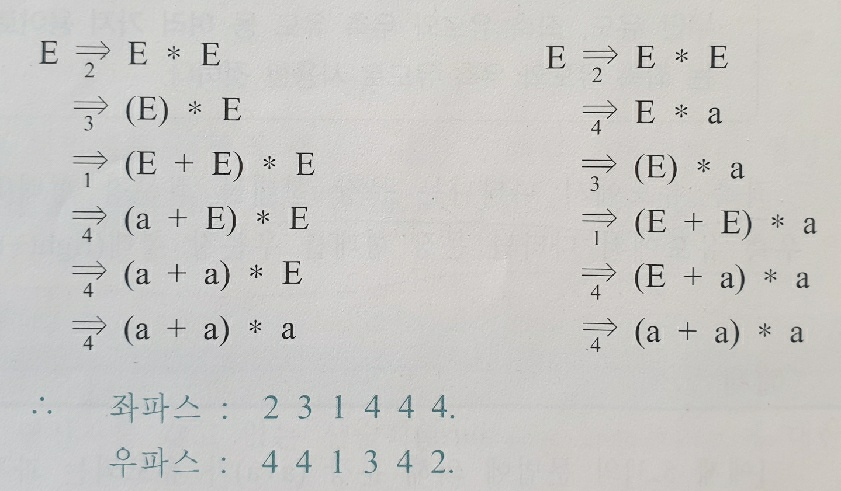

## Context-Free 문법

### 서론

프로그래밍 언어의 **구문 구조를 명시**하는데 널리 사용된 문법

효율적인 구문분석 알고리즘을 가지고 있어 문법적인 **표현**이나 **번역**에 중요

장점

1. 간단하고 이해하기 쉬움
2. 표현된 문법으로부터 **자동으로 인식기를 구현** 가능
3. 입력된 프로그램의 구조를 **생성규칙에 의해 분해 가능**으로 번역에 유리

촘스키 분류에서 형태 2에 해당

기본 문법 표기는 앞부분들과 비슷하다. 더 이상 바뀔수 없는건 terminal 대체가 가능한 심볼은 nonterminal로 생각하면 됨

### 유도와 유도 트리

#### 유도

생성 규칙을 통해 확장이 가능한 점은 다른 정규문법과 비슷하다.

이제 이런 식의 경우를 만들어갈때 유도하는 방식이 여러가지가 있는데 **좌측유도**와 **우측유도**가 있다.

좌측유도를 통해 나온 문장형태를 **좌문장 형태**, 우측유도를 통해 나온 문장 형태를 **우문장 형태**라 한다.

좌측유도를 통해 적용된 일련의 생성 규칙 순서를 **좌파스**(left parse), 우측유도를 통해 적용된 일련의 생성 규칙 번호의 **역순**을 **우파스**(right parse) 라고 한다.

예문)

생성 규칙에 번호를 차례로 붙이고, 문장 `(a+a)*a`의 좌파스, 우파스를 구해보자.

1. E -> E + E
2. E -> E \* E
3. E -> (E)
4. E -> a
   

#### 유도트리

- 문장이 유도되는 과정을 트리 형태로 표현
- 루트노드, 중간노드, 단말노드로 구성

##### 모호성

한개의 문장에 유도트리가 2가지 이상의 방식으로 정의되면 **모호하다**고 한다.

연산순위나 결합법칙을 통해 모호성을 없애주어야 한다.

모호성의 예

위와같이 문법의 규칙이 있을 경우 작성되는 방식이 여러가지가 된다.

우선순위에 따라 가장높은 괄호와 터미널심볼로 논터미널 심볼을 만들고 다음 사친연산 우선순위에 따라 곱셈에 대한부분을 논터미널심볼로 만든다.

### 문법 변환

두개의 문법이 생성하는 언어가 같을 때 문법이 동등하다 라고한다.

이때 한 문법을 다른형태의 동등한 문법으로 변환할 때 **대입**과 **확장** 두가지 방법이 있다.

#### 필요없는 생성규칙 제거

문장을 생성하는 유도 과정에 나타날 수 있는 심벌을 **필요한 심벌** 나타나지 않는 심벌을 **필요없는 심벌** 이라 한다.

제거시 순서

1. terminal 심볼을 유도하지 못하는 non-terminal 심볼을 제거한다.
2. 시작 심볼로부터 도달 불가능한 심볼을 포함하는 규칙 제거

#### ε-free

A -> ε인 경우, ε-생성 규칙이라 부름.

##### ε-free한 경우

1. 모든 생성 규칙들이 ε-생성 규칙을 가지지 않는다
2. 시작 심볼 하나만 ε생성규칙을 가지고 나머지 다른생성 규칙의 오른쪽에 시작심볼이 나타나지 않아야 한다.

예) 아래의 규칙을 ε-free한 문법으로 바꾸시오.
S -> AB
A -> aA | ε
B -> ε

S를 제외한 논터미널심볼의 ε이되는걸 제거 해야함으로 B->ε, A->ε는 제거 되어야한다. 제거하며 대체되는 결과를 넣은 값을 추가한다.

먼저 B -> ε를 제거하면
S -> A | A
A -> aA | ε

다음으로 A -> ε를 제거하면
S -> ε | A
A -> aA | a

이된다.

#### 단일 생성 규칙 제거

단일 생성 규칙은 A -> B 처럼 우측에 **논터미널 심볼**이 하나만 단일로 온경우를 말한다.

