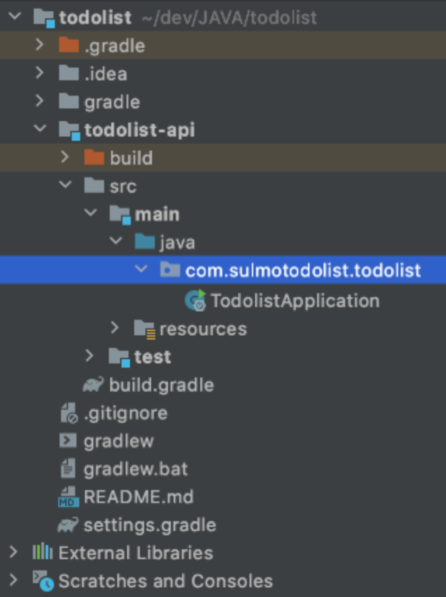
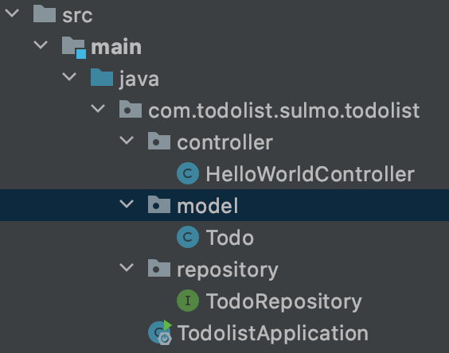

# Spring Boot

자바프로그래밍 수업에서 자바를 이용한 개인 프로젝트를 만들어오라는 과제가있어 스프링부트로 **매우 간단한** api를 만들어보기로 하였다.

자바도 익숙하지않고 스프링도 처음써보는데 어디까지 만들수 있을지.. 최종적으로 DB에서 간단한 쿼리의 데이터를 가져와 프론트까지 뿌려볼 수 있도록 배워볼 계획이다. 고오오급 프론트 개발자가 되기위해 백엔드의 기본적인 구조를 직접 한번쯤은 만져봐야하지 안겠는가!!

## 스프링 과 스프링부트

스프링에는 많은 종류의 모듈이 있고 이를 이용해 초기 셋팅이 복잡하고 어려워짐으로 스프링부트라는 친구가 많은부분을 자동화하였고 나는 스프링 부트를 사용한다.

진짜 바로 코딩만 할수있게 도와준다.

## spring boot 초반 세팅

spring.io에서 spring boot quickstart로 셋팅 후 파일을 받고 이부분에서 gradle과 maven에대해서 처음봤는데 프로젝트 관리 시스템이였고 이때까지 maven을 많이 사용해왔고 gradle이 추적중인데 곧 넘길거라고 한다.

이후는 크게 남겨놓지 않아도 알수 있는 것들임으로 패스

## 초반 세팅 완료시 폴더구조

폴더구조를 가져와 보았다.


## runserver

```bash
    ./gradlew bootRun
```

## test

1. 클래스생성
2. intelliJ에서 `cmd`+`shift`+`t` 를 클래스에서 사용시 테스트 생성을 바로 할 수 있음
3. 2가지의 테스트방법

   ```java
   @SpringBootTest
   class HelloWorldControllerTest {
    @Autowired
    private HelloWorldController helloWorldController;

    private MockMvc mockMvc;
    // 텍스트 결과만 비교하는 테스트
    @Test
    void helloWorld(){
        System.out.println(helloWorldController.helloWorld());
        assertThat(helloWorldController.helloWorld()).isEqualTo("hello World!");
    }
    // http 요청방식, 데이터, 전체 테스트
    @Test
    void mockMvcTest() throws Exception {
        mockMvc = MockMvcBuilders.standaloneSetup(helloWorldController).build();

        mockMvc.perform(
                MockMvcRequestBuilders.get("/api/helloWorld"))
                .andDo(MockMvcResultHandlers.print())
                .andExpect(MockMvcResultMatchers.status().isOk())
                .andExpect(MockMvcResultMatchers.content().string("hello World!"));
    }
   }
   ```

## JPA와 H2 DB 의존성 설치

JPA : ORM(db쿼리 편하게 만들기)이 포함되어있고 영속성(Entity를 영구적으로 저장해주는 환경)을 관리한다고 함\
H2 DB : sqlite3 와같은 아주작은 DB

build.gradle에 의존성 추가하기(package.json과 비슷한 역할을 하는듯한..)

```gradle
    dependencies {
        implementation 'org.springframework.boot:spring-boot-starter-web'
        implementation 'org.springframework.boot:spring-boot-starter-data-jpa'
        implementation 'com.h2database:h2'
    }
```

## DB에 접근 및 수정

하나의 테이블을 예로 만들면 구조가 아래와 같다.


- model : DB에 구성될 모델을 만드는 파일들이 있다.

  ```java
  package com.todolist.sulmo.todolist.model;

  import javax.persistence.Entity;
  import javax.persistence.GeneratedValue;
  import javax.persistence.Id;

  @Entity
  public class Todo {
      @Id
      @GeneratedValue
      private Long id;

      private String content;

      private boolean checked = false;

      public Long getId() {
          return id;
      }

      public void setId(Long id) {
          this.id = id;
      }

      public String getContent() {
          return content;
      }

      public void setContent(String content) {
          this.content = content;
      }

      public boolean isChecked() {
          return checked;
      }

      public void setChecked(boolean checked) {
          this.checked = checked;
      }

      @Override
      public String toString() {
          return "Todo{" +
                  "id=" + id +
                  ", content='" + content + '\'' +
                  ", checked=" + checked +
                  '}';
      }
  }
  ```

  위와같이 구성되며 getter와 setter로 도배가 됨으로 [lombok](#lombok)이라는 패키지가 예쁘고 쉽게 도와준다.

- controller

  ```java

  ```

- repository

  ```java

  ```

## Lombok

- gradle에 lombok관련 의존성을 추가하고
- intelliJ -> preferences -> Build... -> compiler -> Annotation Processor 에 Enable annotation processing에 체크
- 사용
  build.gradle

```gradle
dependencies {
	compileOnly 'org.projectlombok:lombok'
	annotationProcessor 'org.projectlombok:lombok'
	testImplementation('org.springframework.boot:spring-boot-starter-test') {
		exclude group: 'org.junit.vintage', module: 'junit-vintage-engine'
	}
}
```

아래는 getter, setter 자동생성 예이며 이 외에도 많은 기능이 lombok에 있다.

```java
package com.todolist.sulmo.todolist.model;

import lombok.Getter;
import lombok.Setter;

import javax.persistence.Entity;
import javax.persistence.GeneratedValue;
import javax.persistence.Id;

@Entity
@Getter // 세줄의 추가로 Getter와 Setter, ToString을 모두 생성해준다.
@Setter
@ToString
public class Todo {
    @Id
    @GeneratedValue
    private Long id;

    private String content;
    @ToString.Exclude // 해당 필드를 제외하고 투스트링 생성
    private boolean checked = false;
}
```
**Lombok 기능**
- Constructor : 생성자를 만들어주는 어노테이션들이다.
  - @NoArgsConstructor : 인자가 없는생성자를 만들어 줌
  - @AllArgsConstructor : 모든 인자가 있어야하는 생성자를 만들어 줌
  - @RequiredArgsConstructor : 내가 설정한 스키마를 필요로하는 생성자를 만들어줌. 필요한 스키마를 설정하는 방식은 @NonNull을 스키마변수 위에 달아주면 가능
  - HashCode와 Equels : 클래스로 생성된 인스턴스를 비교할때 내부의 내용으로 비교하기위해 equals를 오버라이딩 해야한다. hashcode가 내용이 같으면 같은 값을 같도록 만들어주는 기능이다.
## 출처

- gradle 과 maven : https://okky.tistory.com/179
- spring boot generate : https://start.spring.io/
-
