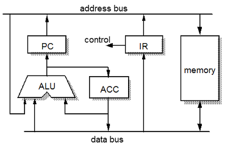

# 컴퓨터 구조

## 컴퓨터의 3대 구성요소

1. CPU
   - ALU : 산술논리연산장치
   - Register : 속도가 빠른 데이터 기억장소
   - control unit : 명령어 해석 실행
     (ALU + Register = Datapath)
2. Memory
3. I/O 장치

## 프로세서와 메모리 생산 기술

- 무어의 법칙
  프로세서 성능이 18~24 개월마다 약 2배의 성능향상을 가져옴

## 메모리

bus : 데이터를 주고 받기위한 시스템

1.  local bus : cpu 내부에서의 버스
2.  gobal bus : cpu, i/o장치, 메모리에서의 버스

버스의 종류

- 주소 버스 : 메모리 주소관련
- 데이터 버스 : 데이터 이동
- 제어 버스 : 메모리를 Read할지 Write 할지

## MU0

가장 기본적인 구성의 프로세서

- 16bit로 구현
  - Opcode(명령어 코드) 4bit, adress가 12bit
- Program Counter Register: 다음 실행할 명령어 저장
  - 메모리에서 데이터를 순차적으로 불러오거나 명령어에 따라서 명령어가 가리키는 주소의 값을 불러옴
- IR : 현재 실행중인 명령어 저장
  - 메모리에서 읽어온 데이터가 이곳에 저장되어 데이터의 opcode를 분석해 명렁어 구분
- ACC(Accumulator : 누산기) : 연산 결과 임시 저장
  - 메모리에서 불러온 데이터 값이나 주소 값을 일시적으로 저장
- ALU : 산술논리연산장치
  - 논리, 산술 연산을 하는 장치 이며 PC의 값을 증가 시켜주기도 함

단계별 동작

1. 명령어 가져오기 : pc에 따라 다음 명령을 IR에 저장
2. 명령어 해석 : 가져온 명령을 IR이 control unit의 도움을 받아 명령어분석을 통해 컨트롤 시그널이 발생(계산, 저장 등등) 그리고 이와 동시에 ALU가 pc를 1 증가시켜 다음 동작을 저장 해 놓음
3. 데이터 가져오기 : IR의 주소에 따라 데이터를 가져와 ACC 또는 ALU에 저장됨
4. 실행 단계 : ALU가 ACC와 ALU의 데이터를 연산 해 다시 ACC에 결과가 저장된다.
5. 결과 저장 : 결과를 메모리에 저장하는경우에 실행되는 단계로 존재할수도 안할수도 있는 단계이다.
