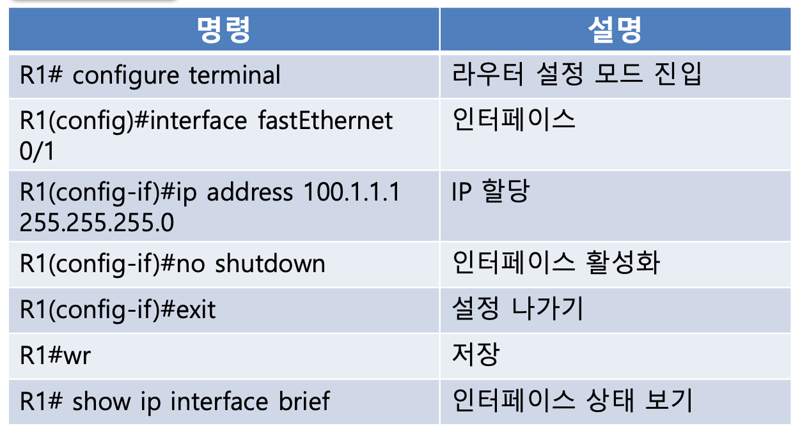

### GNS3 명령어

- pc
  - ip 정보 보기 ()
    ```terminal
    show ip
    ```
  - ip설정
    ```terminal
    // ip [ip주소]
    ip 100.1.1.100 255.255.255.0
    ```
  - ping 보내기
    ```terminal
    ping [ip 주소]
    ```
  - gateway설정
    ```terminal
    ip 100.1.1.100 255.255.255.0 gateway [gateway ip주소]
    ```
- 라우터 명령
  

  - DHCP

    ```terminal
    R1#conf t
    Enter configuration commands, one per line.  End with CNTL/Z.
    R1(config)#ip dhcp pool POOL-1
    R1(dhcp-config)#network 100.1.1.0 /24
    R1(dhcp-config)#lease 1
    R1(dhcp-config)#end
    R1#wr
    Building configuration...
    [OK]
    R1#show running-config 
    R1#show ip dhcp binding      // dhcp 대여상태보기
    ```

  - 디폴트 라우팅 명령
    ```terminal
    R1#conf t
    Enter configuration commands, one per line.  End with CNTL/Z.
    R1(config)#ip routing
    R1(config)#ip route 0.0.0.0 0.0.0.0 192.168.42.1     // 자기 ip 대역에 맞는걸로
    R1(config)#end
    R1#
    *Mar  1 00:10:36.643: %SYS-5-CONFIG_I: Configured from console by console
    R1#wr     // 저장
    Building configuration...
    [OK]
    ```
  - nat inside

    ```terminal

    ```

  - nat outside

    ```terminal

    ```

    ```terminal

    ```
