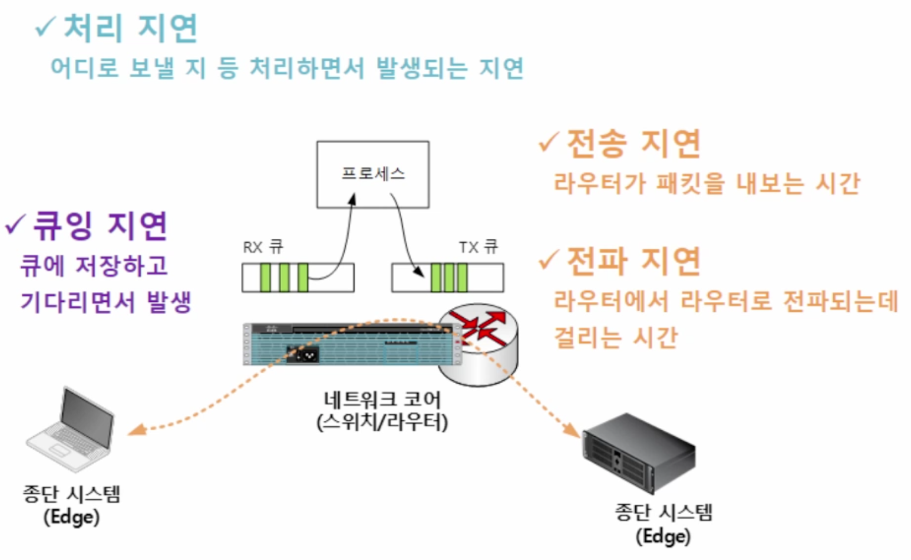
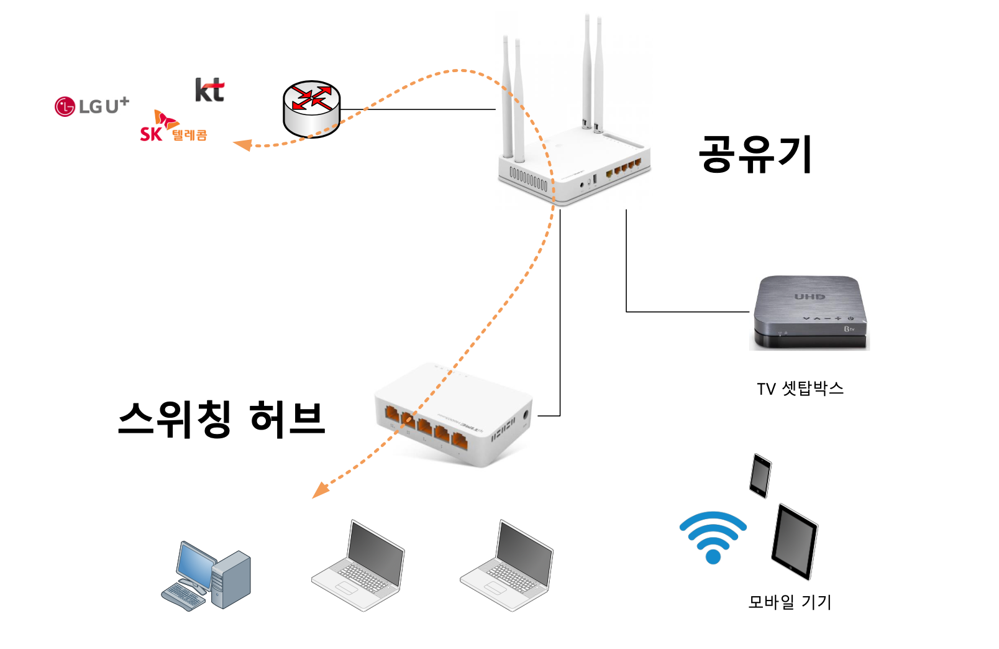
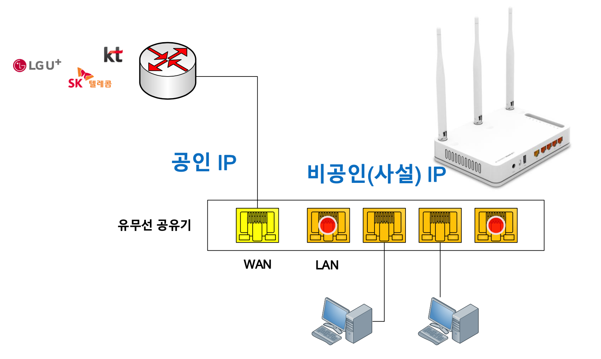

# 네트워크 2주차

- 2021.03.09

## 목차

- 큐잉/처리/전파/전송지연
- 패킷 손실과 처리량
- 큐버퍼 상태 확인 방법
- 홈넷 환경 - 네트워크 코어
- 홈넷의 스위칭 허브 구조

### 큐잉/처리/전파/전송지연

#### 큐잉지연

- RX 큐 : 수신 큐 (여기서 큐잉지연)
- TX 큐 : 송신 큐

모든 기기들은 전송,전달을 위해 외부에서 들어오는 데이터를 대기 시키는 **패킷 버퍼**를 가지고 있다.

패킷 버퍼는 큐로 만들어져 있고 해당 큐에서 발생하는 지연이 큐잉 지연이다.

##### 큐를 실제 확인 하는 방법

#### 처리지연

큐에서 패킷을 받아 목적지로 가기위한경로 탐색이나 판단 등의 프로세스가 처리과정을 거칠때 발생하는 지연

#### 전송지연

송신 큐에서 패킷을 전송하는데 걸리는 시간

#### 전파지연

라우터에서 라우터로 전파되는데 걸리는 시간

### 패킷 손실과 처리량

패킷을 전송하는데 큐로 이루어진 버퍼가 꽉찬 이후 도착하는 패킷들은 저장되지 못하고 손실되는 것을 말한다.

평가 계측기 : 추가적인 장비로 네트워크 코어시스템에 추가적으로 장착하여 해당 네트워크장비의 패킷 **처리량** 등을 계측하고 이를 활용하는 장비이다.

평가 지표

- Throughput
- Latency
- Packet loss
- TPS(Session) : 세션을 얼마나 맺을 수 있는지

[실습](큐버퍼상태확인.md)

### 홈넷 환경-네트워크 코어

기업에서 구성된 네트워크 환경까지 아니여도 네트워크 실습을 할수 있다. 다들 집에있는 공유기를 가지고 실습할수 있는 과정을 살펴 봅니다.

가정에서 L3역할을 해주는게 인터넷 공유기입니다.
[L2~L7까지 뭔가 간단명로하게 잘 설명되어있는 글](https://ngg3319.tistory.com/102)

- 공인IP : WAN에 해당하여 L3계층의 프로토콜을 읽을수 있어 라우트역할을 할수 있기때문에 L2까지만 가능한 LAN에서 못하는 외부와의 연결을 도와줍니다.
- 비공인IP : LAN에 해당하며 같은 공유기에 연결되어있는 모든 기기들끼리 통신이 가능하다.
  - 웹개발시 프레임워크에서 로컬로 연결했던 사용했던 주소들
  - 192.168..
  - 172.xxx

### 홈넷의 스위칭 허브 구조

- 더미허브 : 허브에 들어오는 정보를 다른 포트에까지 모두 전달되는 방식으로 다른 포트의 정보를 스니핑하는것이 가능해 보안상 문제가 많았고 비용 또한 많이 걸린다.
- 스위칭허브 : 모든 포트로 전달되지 않고 룩업엔진을 사용해 MAC주소가 일치하는 포트로 전달해주는 더미허브의 약점을 보안한 허브입니다.

### 7계층 : 응용계층 (L7)

사용자와 가장 가까운 계층입니다. 브라우저나 소프트웨어에서 사용되며 대표적인 프로토콜의 예는 SMTP(email), HTTP/HTTPS, DNS, FTP 등이 있습니다.

### 6계층 : 표현계층 (L6)

L7에서 만든 데이터들을 이더넷 프레임에 담기위해 형식에 맞게끔 변화시켜주는 역할을 합니다. 활용의 예로는 HTTPS를 사용하게되어 데이터를 암,복호화를 하기도 하며, 영상을 MPEG에 맞게, 사진을 GIF형식으로 변환하는 작업들이 있습니다.

### 5계층 : 세션 계층 (L5)

4계층에서 TCP같은 경우는 세션의 연결에 있어서 매우 중요한데 이처럼 세션을 관리해야하는 경우에 연결 방법과 관리를 맡아주는 계층입니다.

[위의 계층들에서 나온 부분을 실습을 통해 직접 확인 해 봅니다.]
