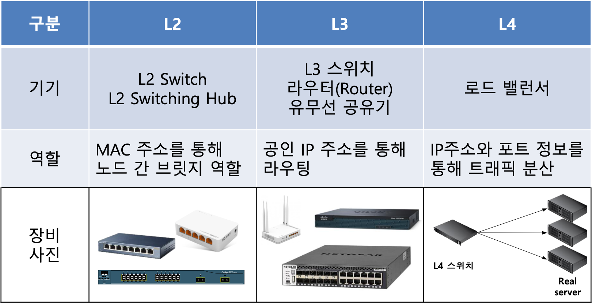
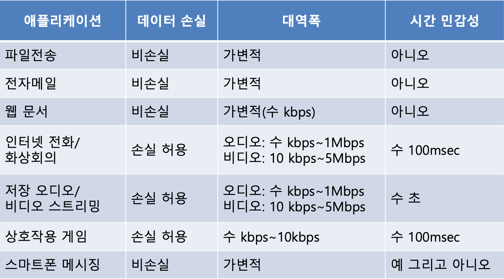
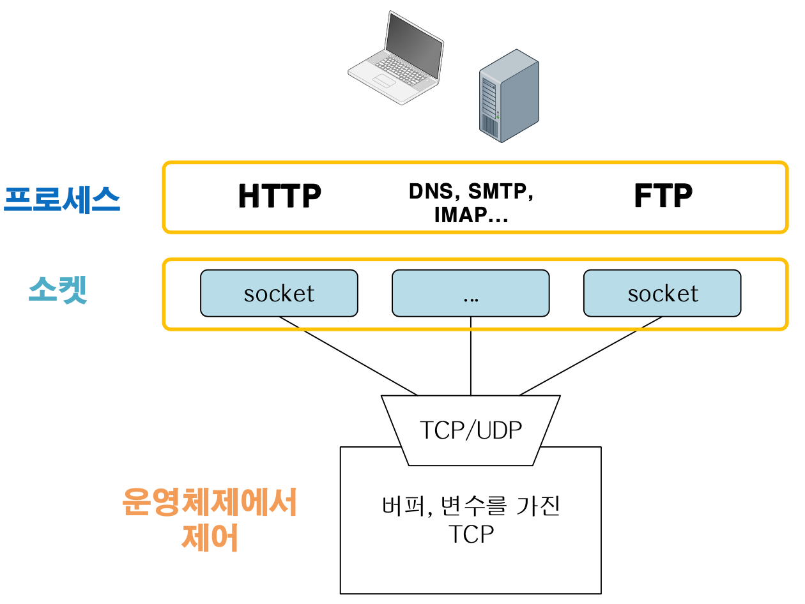
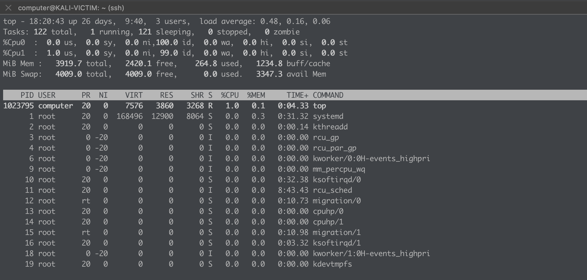
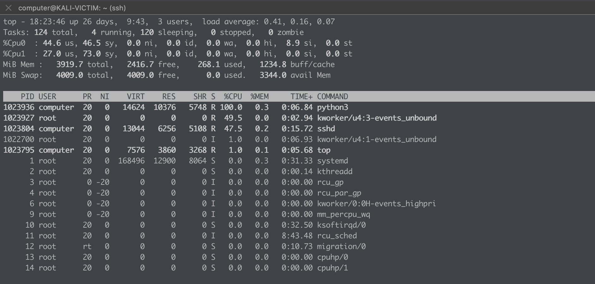

## 네트워크 장비 및 보안

### 네트워크 코어장비



### 네트워크 보안장비

- 게이트 웨이 모드 (방화벽)
  - 물리 포트에 ip주소를 부여
  - 라우팅 역할이 필요
  - L3부터 L4까지 검사 가능
- 브릿지 모드 (침입 방지 시스템)
  - L2계층에서 IP주소 없이 투명모드로 운영(패킷 변조가 없음)
  - L2부터 L7까지 검사 가능

TCP 재전송 주기는 2의 배수

## 어플리케이션 계층

- Client/Server
  - 서버와 클라이언트가 단일로 통신
  - 고정된 포트로 서버가 운영중
  - FTP: 21번 , DNS : 53번
- Peer-to-Peer
  - 토렌트와같은 방식
  - 개인과 개인간의 통신으로 개인이 할당한 포트이기 때문에 고정적이지 않다.

### 네트워크 게임구조

- P2P : 서든어택
  - 공인 아이피를 사용중인 호스트 유저를 기반으로 개인과 개인간의 연결로 빠르고 역동적인 플레이가 가능하다.
  - 아이피를 쉽게 찾아 낼 수 있어 해당 아이피로 트래픽을 과도하게 보내 유리한 위치로 플레이하는등 보안적 취약 요소가 많다.
- C/S : 배틀그라운드
  - 서버와 클라이언트만 소통하는 완전한 c/s구조는 아니지만 중간에서 서버가 추가적으로 데이터를 교환해 주는 방식의 통신이다.
  - 릴레이서버를 두어 상대방의 아이피를 알 수 없다.
  - 초반에 연결 장애가 많이 있었으며 서버를 증설과 같은 대처로 해결해 나감

### 네트워크 어플리케이션 요구사항



### 프로세스와 네트워크 간의 인터페이스



### 프로세스 상태확인

리눅스 내부에서 프로세스 상태를 확인하는 명령어이다.

1초 간격의 딜레이로 상태확인

```bash
top -d 1
```

`1`을 입력시 cpu의 개수만큼 분할하여 확인가능



무한루프 코드 실행시

