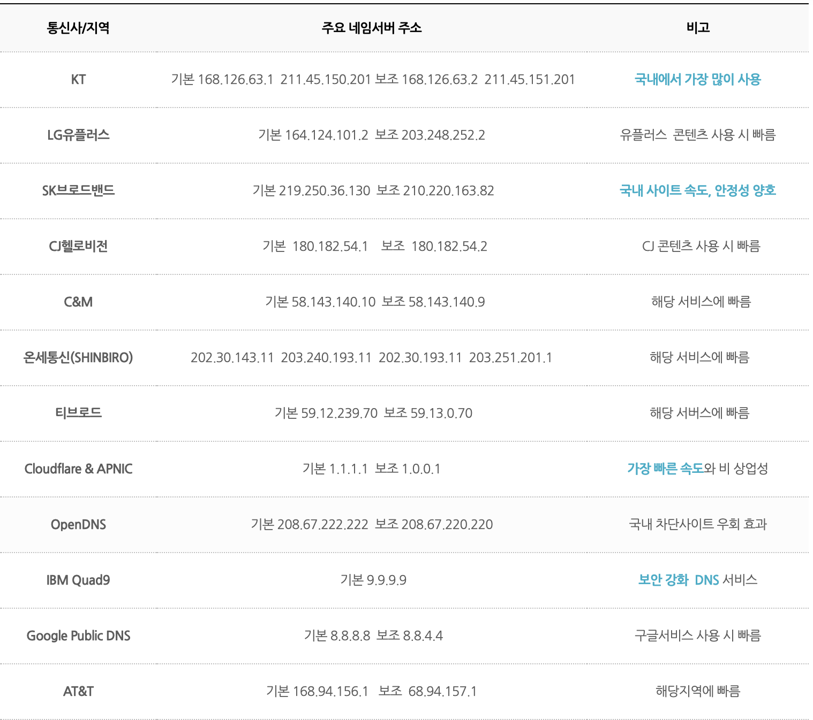
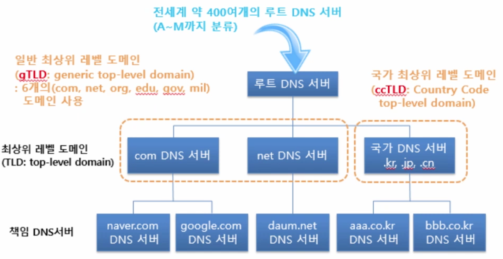
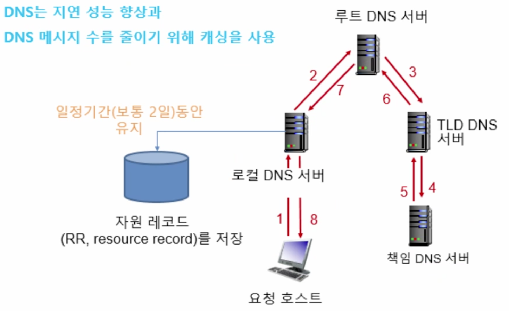

### DNS

도메인 네임 서비스는 기억하기 힘든 서버의 주소에 이름을 부여해 매핑해주는 서비스이다.

dns에 주소 요청

``` bash
➜  ~ nslookup www.naver.com

;; Got recursion not available from 211.252.120.62, trying next server
Server:		168.126.63.1
Address:	168.126.63.1#53

Non-authoritative answer:
www.naver.com	canonical name = www.naver.com.nheos.com.
Name:	www.naver.com.nheos.com
Address: 223.130.195.200
Name:	www.naver.com.nheos.com
Address: 125.209.222.142
```

위의 예처럼 dns에 처음에 요청을 넣고 이에 반환값을 통해 우리가 원하는 서버에 접속을 합니다.

#### DNS의 종류



운영체제별로 dns설정을 할 수 있는 세팅기능이 있는데 위의 dns서버리스트중 하나로 세팅되어있는듯 합니다.

[이미지 출처](http://www.codns.com/b/B05-170)

#### DNS 서버의 역할 3가지

도메인 네임과 호스트 네임
- 도메인네임 : 해당 서버ip 자체를 대표 이름
- 호스트네임(서브도메인) : 해당 서버의 서브 서비스별로 가진 서브 도메인들에대한 이름
- 예시 (naver)
    - 도메인 네임 : naver.com

    - 호스트 네임 : www.naver.com, cafe.naver.com, mybox.naver.com 등등

    - 처음 알았는데 www.naver.com과 naver.com은 분리가 가능합니다. naver를 예로 naver.com은 네이버의 모든 호스트네임에대한 대표 같은 정보이고 도메인네임으로 접속시 main페이지인 www.naver.com로 리다이렉트 되는것 같습니다. 이후 cafe나 mybox등등 이있는데 앞에 www.을 붙이면 연결되지 않습니다.

##### 호스트 엘리어싱(host aliasing)

호스트 네임은 하나이상의 별칭을 가질 수 있으며 호스트 네임보다 별칭이 더 기억하기 좋다.


``` bash
➜  ~ nslookup -queyr=cname www.naver.com
*** Invalid option: queyr=cname
;; Got recursion not available from 211.252.120.62, trying next server
Server:		168.126.63.1
Address:	168.126.63.1#53

Non-authoritative answer:
www.naver.com	canonical name = www.naver.com.nheos.com.
Name:	www.naver.com.nheos.com
Address: 125.209.222.141
Name:	www.naver.com.nheos.com
Address: 125.209.222.142
```
네이버 메인페이지의 정식 호스트 이름은 www.naver.com.nheos.com입니다.

아래 블로그글이 사용예시로써 이해하기 좋았습니다.
[cname의 사용 예](https://thebook.io/007046/ch07/02/05/03/)

##### 메일 엘리어싱

기업의 메일서버와 웹 서버가 동일한 호스트 네임(별칭)을 가지도록 허용해 줍니다.

##### 부하 분산

여러 개의 IP주소가 정식 호스트네임과 연관되도록 설정할 수 있다.
DNS에 질의를 하면 등록된 여러개의 IP를 순환해 반환한다. nslookup으로 조회시 도메인네임 또는 호스트네임마다 여러가지 ip가 출력되는 경우가 있는데 그만큼 서버가 여러대로 운영되고 있으며 한쪽에 몰리지 않고 분산시켜 부하를 분산 시켜준다.

#### DNS 동작원리

- UDP(53번 포트) 프로토콜를 사용 : DNS는 인터넷을 사용하는 모든 사용자가 사용하는 서버임으로 트래픽이 많고 빠르 속도를 지원해야 합니다. 요청에대한 쿼리양이 많아지면 TCP를 사용하기도 합니다.
- 분산된 계층 데이터베이스로 구성
    
- 로컬 DNS 서버 : 우리나라를 예로 SKT, KT, LG에서 제공하는 DNS를 말합니다. ISP에서 DNS를 운영해 제공하며 DNS 방식중 하나이므로 어떤게 더 빠를지 생각해보고 사용하면 될듯 합니다.
  
#### DNS 캐싱

자주 사용되는 도메인을 DNS에서 보관해두는 것


#### DNS 레코드와 메시지

- 자원 레코드 형식
  - Name : 상직적 이름
  - Type : 유형
  - Value : 타입에 따른 값을 부여
  - TTL : dns 캐싱 정보의 유지시간
- Type 별 레코드 예시
  - Type=A(1) : 호스트의 ip 주소 매핑
    - Name : 호스트 이름
    - Value : IPv4 주소(IPv6는 따로인가...?)
  - Type=NS(2) : 주어진 호스트에 대한 공식적인 이름 서버를 알려줌
    - Name : 도메인 이름
    - Value : 네임서버의 호스트 이름
  - Type=CNAME(5) : 소유한 도메인에 별칭을 지정
    - Name : 별칭 호스트네임
    - Value : 정식 호스트네임
  - Type=MX(15) : 메일에대한 별칭을 저장, 메일 수신서버 지정
    - Name : 메일서버 별칭
    - Value : 호스트 이름