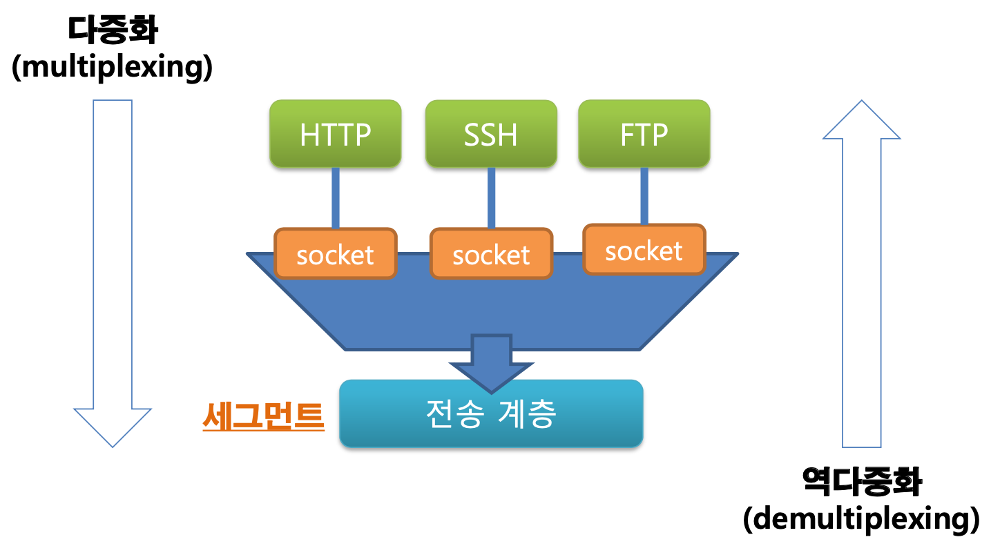

# 전송계층

전송 계층 단계에서의 데이터형태의 이름을 세그먼트 라고 말한다.

- 세그먼트의 헤더 : TCP/UDP헤더 | 데이터 (전송계층)

  - UDP 헤더 구성(각 16bit씩) : 출발지포트번호, 목적지포트번호, 길이, 체크섬

- 데이터링크의 헤더 : IP헤더 | TCP/UDP헤더 | 데이터 (네트워크 계층)

## 포트 범위

- 0번 ~ 1023번: 잘 알려진 포트 (well-known port)
- 1024번 ~ 49151번: 등록된 포트 (registered port)
- 49152번 ~ 65535번: 동적 포트 (dynamic port)

## 다중화와 역다중화

여러가지의 서비스를 한 서버(ip를 소유한)에서 가지고 있으며 전송계층은 해당 정보들을 보내거나 수신하게 되는데,

각 프로토콜이 서버에대한 포트번호를가지고 소켓을 생성하여 응답을 보내거나 받는다. http(80), ssh(22), FTP(21)

이 과정에서 많은 프로토콜들을 포트로 분류하여 만들어온 데이터를 전송계층의 세그먼트화 시키는걸 **다중화** 라고 하며,

이와 반대로 네트워크계층에서 전송계층으로 들어온 데이터그램을 세그먼트화 하여 각 포트에 전송해주는 과정이 **역다중화** 이다.

### UDP/TCP의 다중화 역다중화 차이점

UDP : 동일한 소켓으로 모든 사용자와 통신
TCP : 사용자별 다른 소켓으로 통신

교제 180, 181 필독

### UDP 체크섬

UDP의 체크섬 : 비트의 변화가 있는지 체크하여 손실의 여부를 확인합니다.

**체크섬을 이용한 확인 방법**

        1. IP헤더의 일부와 UDP헤더 UDP의 데이터를 16비트씩 다 자른 후 더합니다.
        2. 그다음 오버플로우로 생긴 값을 또 더함
        3. 다 더한 후 그값을 1의보수화 시켜 UDP헤더의 체크섬 값에 넣음
        4. 이제 수신측에서 확인작업으로 똑같이 16비트분할, 더하기 후 체크섬값과 더했을 때 모든 값이 1로 나오면 손실된 데이터가 없다고 판단가능
        5. 체크섬값으로 바꿀때 모든데이터를 다 더했었기 때문에 하나라도 틀리면 1이 나올 수 없다.

### TCP의 SEQ/ACK 번호

