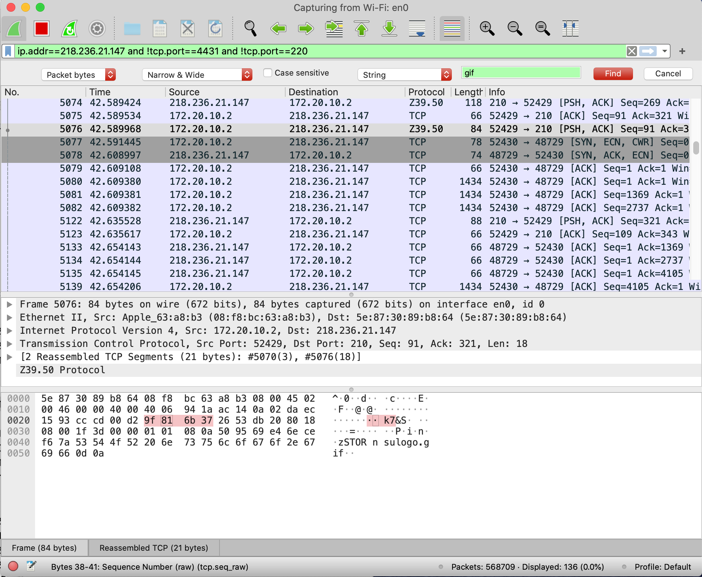

파일 질라 : 파일 전송
헥사 뷰어 : 파일 데이터를 16진수로 보여줍니다.
와어이 샤크 : 패킷을 덤프떠서 그중 파일이 전송된 패킷을 찾아 봅니다.

운영체제에서 사진파일을 파일질라에게 넘겨 이를 전송하기위해 프로토콜들로 포장을하고 외부망을거쳐 다른 서버쪽으로 파일을 전송시킵니다.

이 과정에서 와이어 샤크를 통해 해당 파일의 패킷 정보를 뜯어보는 과정을 실습합니다.

위 사진처럼 nsulog.gif라는 파일을 포함한 패킷을 확인 할 수 있습니다.
