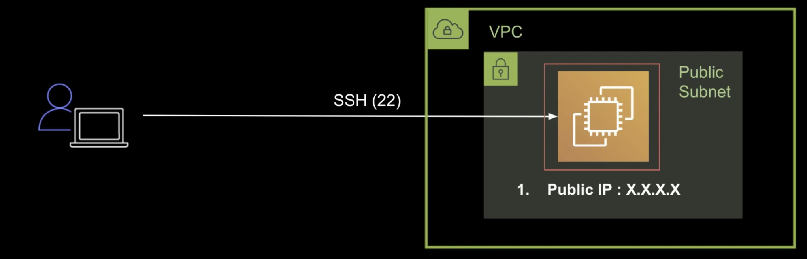

### ssh 접속

aws 인스턴스에 접속이 안될 때 확인 리스트
1. 포트와 퍼블릭 IP 확인, private IP로는 접속이 불가능합니다. [퍼블릭 IP와 사설IP 비교](https://velog.io/@hidaehyunlee/%EA%B3%B5%EC%9D%B8Public-%EC%82%AC%EC%84%A4Private-IP%EC%9D%98-%EC%B0%A8%EC%9D%B4%EC%A0%90)
2. security group 확인 : VPC에다 만들었을 때, aws에서 기본적으로 적용하는 보안 시스템. 내클라이언트 IP와 security에 등록되어있는 IP가 일치해야 접속이 가능
3. ec2인스턴스가 public subnet에 위치해 있는지 확인해야 함. VPC -> Route -> route table 탭에 가면 게이트웨이를 확인 할 수 있는데 이 설정이 0.0.0.0/0 (전체 수용)이 되어있는지를 확인합니다. [nacl](https://docs.aws.amazon.com/ko_kr/vpc/latest/userguide/vpc-network-acls.html)을 잘 쓸일은 없다고하지만 상황에 맞게 필요하다고 함.

#### ec2 생성

- amazon Linux
- vpc(default)에 서브넷은 임의로 하나선택(해당 리전에도 물리적으로 어느정도 떨어진 위치에 구성됨)
- 퍼블릭 IP 자동할당 활성화
- t2.micro(프리티어) 강의에선 t3.nano사용
- 볼륨선택 gp3(ssd)
- 보안그룹 새로 생성 (소스 위치 무상관 anyware 선택, 액세스 가능 IP를 따로 지정 가능)
- 태그 {Name : Test-EC2}
  
#### ssh 접속 명령
Amazon Linux의 최초 유저는 ec2-user, ubuntu사용시 ubuntu가 기본 유저

원격 접속하기
> ssh -i [key파일 위치] [최초 유저]@[public IPv4] -p[포트번호]
> ssh -i ./test.pem ec2-user@xx.xx.xx.xx -p22

-p22는 기본포트라 작성하지 않아도 됨

unprotected pirvate keyfile!!!
키파일에대한 권한이 너무 넓어 경고하며 접속이 되지 않음

[리눅스 허가권에대한 글](https://nalt-it.tistory.com/22)

chmod 명령으로 권한을 수정한다

> chmod 600 // owner의 읽기 쓰기 허용

RSA 공개키 암호화방식에 대해 꼭 이해하세요.

#### ssh 알아보기

위에서 

> ssh -i ./test.pem ec2-user@xx.xx.xx.xx -p22

로 접속했다는 뜻은, 해당서버가 22번 포트로 접속을 기다리는 상태라는 뜻

> netstat -lntp

명령으로 상태를 확인가능

#### key pair

키페어로 어떻게 접속하는지 알아봅니다

RSA 공개키 알고리즘을 통해 public key와 private key로 적합성 판단 이후 연결하는 방식이라고 합니다.

ec2에는 

> ~/.ssh/authorized_keys 가 존재

해당 파일에 키리스트(public key)를 정리하고 다운받은 pem(private)키로 접속하는 방식입니다.

key pair generater로 키쌍을 만들고 위 파일에 public key 입력 후 private key 파일을 만들어 같은 방법으로 접속이 가능합니다. 
